# Blackjack

## A Simple Blackjack game written in JavaScript


You can view the Blackjack live site [HERE.](https://davewatters.github.io/blackjack)
<br />
<br />
<!-- Responsive desgin sample image from http://ami.responsivedesign.is/ -->
<h2 align="center">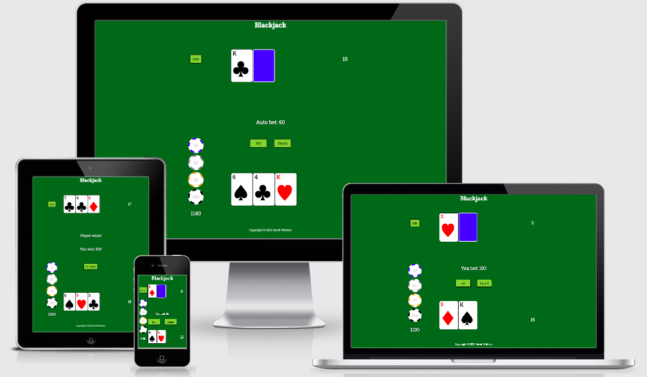</h2>

## - Table of Contents -
* [Purpose](#purpose)
* [User Experience Design (UX)](#user-experience-design)
* [Features](#features)
* [Technologies](#technologies)
* [Testing](#testing)
* [Deployment](#deployment)
* [Credits](#credits)

## - Purpose -
[ This website was created as the second Portfolio Project (PP2) for the Code Institute's Full Stack Web Development course. ]

The site was built as a simple Blackjack game to be played just for fun. To that end, it was kept simple - uncluttered and uncomplicated. It was designed to appeal to both novices and seasoned card players alike, so it features a betting function with an available stack of chips - however, no actual real money is gambled.  The thrills of the of the ups and downs of each round of betting is allowed to happen easily by a design which keeps the options simple and enables the player to quickly move the action along. Settings can be changed to increase the difficulty.  The site was designed using a

As a requirement for a portfolio project it is built as a responsive, interactive, front-end web site using HTML & CSS, and showcasing JavaScript skills.  

## - User Experience Design -

-   ### User stories

    -   ### Design Strategy Goals
        -    Create a simple onine Blackjack card game which will appeal to wide range of users
        -    Site must be intuitive to read & navigate on both desktop & mobile devices - using Mobile First design

    -   ### Design Scope to Deliver MVP
        -   #### First Time Visitor Goals
            As a first time user...
            -   I want to be able to intuitively navigate the site
            -   I want to easily find instructions to understand how to use the site
            -   I want to be able to easily & quickly play the game
            -   I want the site to be visually clear & appealing

        -   #### Returning Visitor Goals
            As a returning visitor...
            -   I want to be able to quickly play the game
            -   I want to be able to view and play the game on a mobile device

        -   #### Frequent User Goals
            As a frequent user...
            -   I want to to be able to increase the difficulty level of the game to make play more exciting


-   ### Design
    -   #### Layout
        The game is to be kept simple and presented on the main landing page. This is also to be the game play area. Additional information like instructions, game rules or configurable settings should appear as a clear overlay of the main game area without navigating away from the page. Using mobile-first design meant that everything necessary for game play, information and settings is compact, easily accessible and readable.

    -   #### Colour Scheme
        The default background was chosen to resemble a casino card table's green baize. The colour scheme then had to work and contrast with that. White text is what works best against this green and a much brighter green was then chosen for the control buttons, and an even brighter lime-green for their highlighting. The main focus of the game are the cards and stack of chips, so these were made to look as close in style of real cards and casino chips are possible using standard colours (e.g. blue, orange etc.). Built-in HTML entities (&spades;, &diams;  etc.) were used to depict a simple card instead of using elaborate graphics. All of the colours have 'AAA' WCAG 2.0 contrast scores. The results of the colour contrast testing are included in the [Testing](#testing) section below.

        - Colour choices
            - Background: Card Table green, #076324
            - Text elements: White on Green background
            - Playing cards: Black & Red on white
            - Modal pages: A pale, cool off-white, #eef4f4

    -   #### Typography
        The Google font, Roboto Slab, was chosen as it resembles the old typewriter-style lettering used on traditional playing cards, but has heavier lines which lends itself standing to out better on smaller screens.  
        Google font, Lora Bold, was chosen for the main game heading as it is also heavy with its headline-worthy thick letters which make it really stand out.  I also liked its playful look - the capital 'B' and the the lowercase 'j'. It is a serif, like  the Robot Slab, and both work well together.


    -   #### Imagery
        The screen is all about the casino look - green card table with cards & betting chips contrasted in stark relief. No elaborate imagery was necessary and would have detracted from the purpose of the site for the end user - which is to focus on repeatedly playing hands of blackjack to try to beat the dealer at each turn.    
    
    -   #### Wireframes
        I did not create wireframes with software like Balsamiq, but I have decided to include pictures of my pencil sketches of my layout design process.  These do not necessarily represent the final look of the site pages, but are presented here to show how I went about fleshing out my initial thoughts and ideas about how to structure the site before a line of code was written.
<h2 align="center">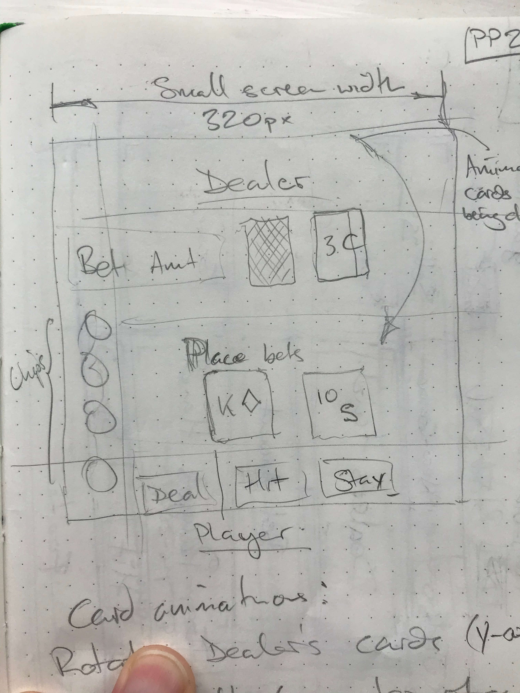</h2>
<h2 align="center">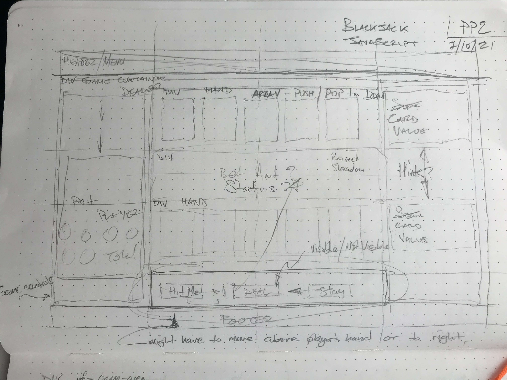</h2>
<h2 align="center">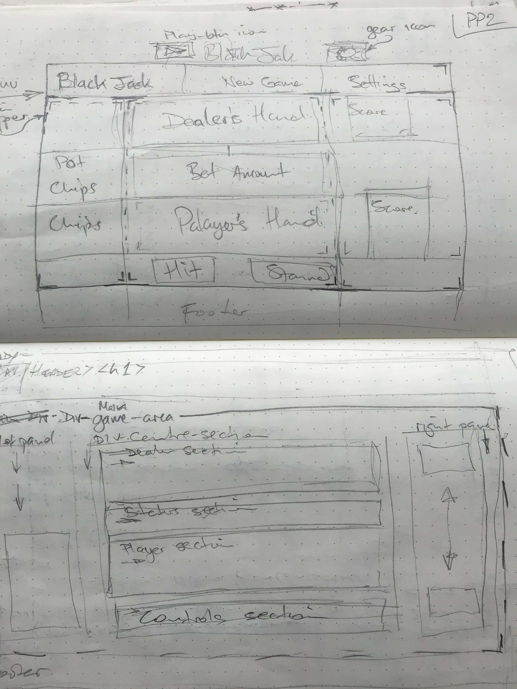</h2>
<h2 align="center"></h2>

## - Features -
To fulfil the needs of the site's users, the following features were implemented:

- **Simple Game Area** takes the player straight into the action of the game by presenting the casino card table look in an uncluttered way. Once play commences, each player's cards are displayed in the relevant section.
<h2 align="center">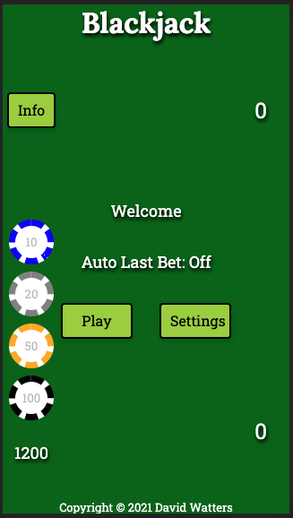</h2>
<h2 align="center">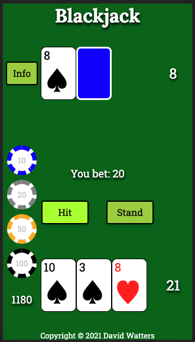</h2>  

- **Control Buttons** are only visible when relevent to the play, e.g Deal or Hit & Stand.
<h2 align="center">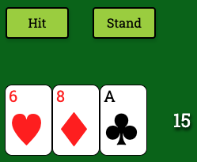</h2>

- **Info Button** is available at all times and allows the user to show instructions and strategy hints at any time during the game. This takes the form of an overlay with clear text on a light background. As can be seen from the above images, the button is accessible throughout the game play. The information is then presented clearly to the user, as shown below.
    - This allows the user to easily find instructions to understand how to use the site.
<h2 align="center">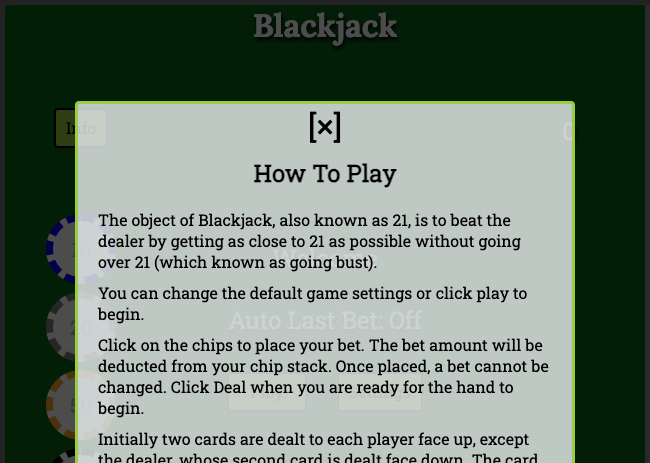</h2>

- **Betting** The player's stack is visible at all times and the betting chips are styled with a semblance of real casino chips.  The total value remaining is clearly diplayed, as is the currrent bet amount.
    - This fulfills the user's thrills of winning or losing bets against the dealer.
<h2 align="center">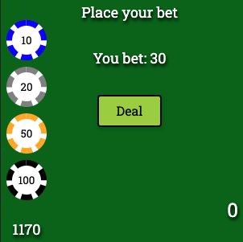</h2>

- **System Messages** are short and to the point, e.g. Dealer busts or You win, and displyed clearly in the centre. 
    -   This allows the user to navigate the site intuitively, in this case between the game's stages of play.
<h2 align="center">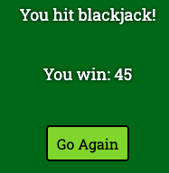</h2>
<h2 align="center"></h2>

- **Settings** were kept to a few simple choices which allow for increased game complexity. The sttings can be accessed before play begins and the user only needs to chose from some radio button optiions.
    - This allows the user to be able to increase the difficulty level of the game to make play more exciting.
<h2 align="center">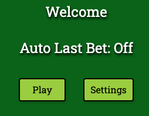</h2>  
<h2 align="center">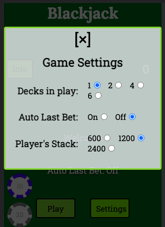</h2>  

## - Future Features -
- Sound effects would enhance the experience - a subtle card-dealing sound, cards being shuffled etc.
- Ability to double down and split bet (an option in casinos where a player is dealt a pair and can then chose to effectively play both hands as independent bets).

<!--  -->
<!-- End Features -->
<!--  -->


## - Technologies Used -

### Languages Used

-   [HTML5](https://en.wikipedia.org/wiki/HTML5)
-   [CSS3](https://en.wikipedia.org/wiki/Cascading_Style_Sheets)
-   [JavaScript](https://en.wikipedia.org/wiki/JavaScript)

### Frameworks, Libraries & Programs Used

1. [Git](https://git-scm.com/)
    - Git was used for version control and managed via the VSCode terminal to commit to Git and Push to GitHub.
1. [GitHub:](https://github.com/)
    - GitHub is used to store the project's code after being pushed from Git, and Github Pages used to deploy the live site
1. [Google Fonts:](https://fonts.google.com/)
    - Google font(s) were imported in the style.css file and used throughout the site.  
1. [Font Awesome:](https://fontawesome.com/)
    - Font Awesome was used to add icons for aesthetic and UX purposes.   
1. [TinyPNG:](https://tinypng.com/)
    - tinypng.com was used to compress large images

<!---  --->
<!---  Begin testing section --->
<!---  --->

## - Testing -
### UX Goals, User Stories

-   #### As a first time user...
    -  I want to be able to intuitively navigate the site
        -   I tested to ensure that all of the buttons link to their intended functions. The game play buttons only appear when required - e.g Deal once the bet is placed or Hit & Stand when the initial two cards are dealt. Only two take the the user to a different page - the Info & Settings buttons. These are overlay pages. I tested to ensure that the user could open them easily and return to the previous page on closing them.
    -  I want to easily find instructions to understand how to use the site
        - I tested to ensure that the Info button is always visible and takes the user to the page of instructions. 
    -  I want to be able to easily & quickly play the game
        - I tested to ensure that the Play button to start the game is visible on the main screen. When clicked it begins the round of dealing by waiting for the user to place a bet. I tested that the user can click on the chips to add that amount to this bet. When the user is ready to play and clicks Deal, I tested that initially two cards are dealt to both the player and the dealer, with the dealer's second card displayed face down. I tested that the optins now available are to either Hit for another card or Stand for the dealer to play. I tested that the dealer's hand plays out until the one of three outcomes: win, lose or draw. The relevant status message is displayed and play returns to the player placing a bet for the next round 
    -   I want the site to be visually clear & appealing  
        - I tested to ensure that the game play resembles a card table and that the cards are clearly displayed for each stage of the round. Status messages are presented after each action. The betting buttons are also rendered to look like casino chips. The relevant action buttons appear when required.   

-   #### As a returning visitor...
    -   I want to be able to quickly play the game
        - The game was tested to ensure that it is playable using the default settings within one click. 
    -   I want to be able to view and play the game on a mobile device
        -  Testing was done to ensure that the site was responsive on all device screen sizes and that the information was clearly readable and accesible.

-   #### As a frequent user...
    -   I want to to be able to increase the difficulty level of the game to make play more exciting  
        - I tested to ensure that the game settings could be changed to make the game more difficult - e.g. the nunber of decks of cards in play can be increased and the starting amount of the betting stack.

### Code Validation
The [W3C Markup Validator](https://validator.w3.org/#validate_by_uri), [W3C CSS Jigsaw Validator](https://jigsaw.w3.org/css-validator/#validate_by_uri) and the [JSHint JavaScript Code Quality Tool](https://jshint.com) were used to validate every page of the project for syntax errors. **NOTE: All validation was re-run after fixing any errors shown below to ensure that no further errors or warnings existed.**

-   index.html: incorrect use of aria-label was flagged. This was initially coded because the button on the Info form is actually a ```<span>``` element. This was refactored to use a ```title=""``` attribute instead. No errors or warnings were found when retested.
<h2 align="center">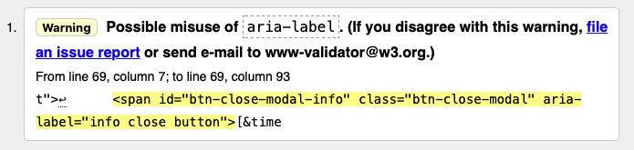</h2>

-   style.css: no errors were found
<h2 align="center">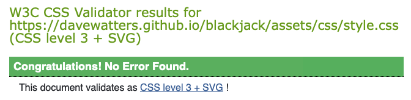</h2>

- script.js: four warnings, three unused variables. These were addressed and retested. Warning for Line 1 is not relevant to this project. The warning for line 40 can be ignored as it does not cause any confusing semantics in this project. (First and second test images shown below)
<h2 align="center">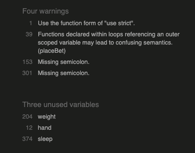</h2>
<h2 align="center">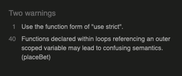</h2>

### Responsiveness
- Chrome DevTools and a Chrome extension, [Unicorn Revealer](https://chrome.google.com/webstore/detail/unicorn-revealer/lmlkphhdlngaicolpmaakfmhplagoaln?hl=en-GB), were used to check responsiveness on various device sizes. 
<h2 align="center">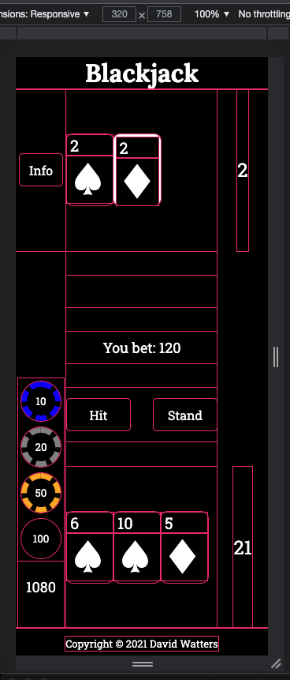</h2>
<!-- <h2 align="center">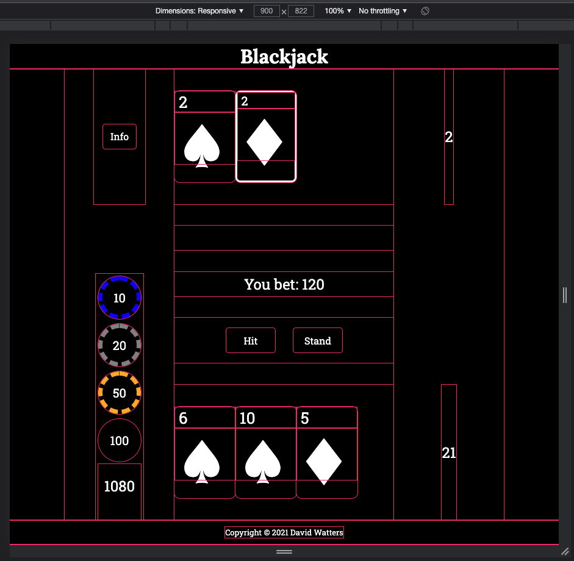</h2> -->

### Colour Scheme
The colour scheme was tested using this [Contrast Grid Test](https://contrast-grid.eightshapes.com)
and, as explained previously in the Design - [Colour Scheme](#colour-scheme) section, my decision was based on the results shown here:
<h2 align="center">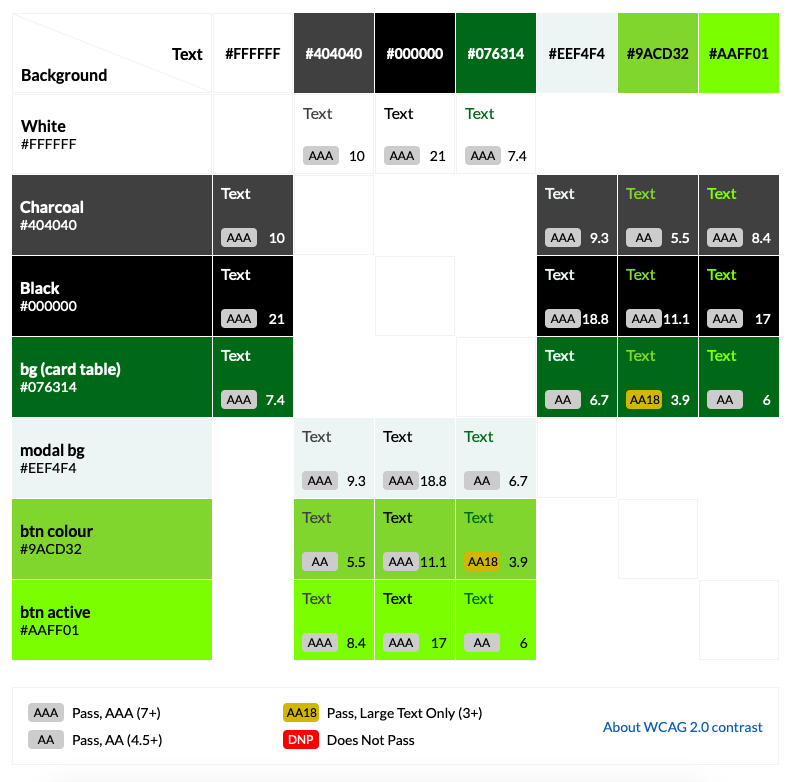</h2>

-   The Website was tested on Firefox, Safari, Chrome and Edge browsers.
-   The website was viewed on a variety of mobile devices such as iPhone7, iPhone 8 & iPhoneX.

### Further Testing
Googe Lighthouse in Chrome DevTools was used after deployment to test the quality and performance of the site. Results were very satisfactory for Performance (99), Accessibility (100), Best Practises (100) and SEO (100).
<h2 align="center">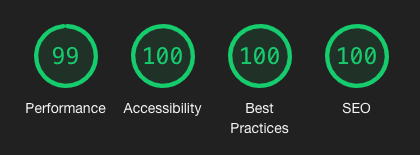</h2>


### Bugs

1. A screen reader picked up the red card suits (Hearts & Diamonds) as black - e.g it read "black heart". This is because this is the full name the underlying HTML entity (see https://www.w3schools.com/charsets/ref_utf_symbols.asp). Note: there is a also a White Heart Suit entity which uses just the outline of the shapes. [ Thanks to my mentor Daisy McGirr for mentioning the screen reader test ]
    - to fix: disp red card to screen reader (bug: SR reads red suit as black) 
1. to fix: ensure that shufffling msg is seen by using modal
1. to fix: when five cards are drawn and not bust, dealer plays next
1. to fix: fix the way aces are calculated if draw ace and one in hand

<!---  --->
<!--- end of testing section --->
<!---  --->

## - Deployment -

### GitHub Pages
The live deployed site can be viewed on GitHub Pages [HERE](https://davewatters.github.io/blackjack)

The Project repository (repo) is at [https://github.com/davewatters/blackjack](https://github.com/davewatters/blackjack)

Note: The project repo was initially generated from the [Code Institute full template](https://github.com/Code-Institute-Org/gitpod-full-template) 

Deployment of the site to GitHub Pages was done as follows:

After final `git push` to the project repo 
1.  Login to your GitHub account
1.  Open the project repo 
1.  Select the 'Settings' tab
1.  On the left-hand-side menu select the Pages option
1.  Select the main branch as the source, then click the Save button
1.  A message will confirm that the site has been published at `https://YOUR-GITHUB-NAME.github.io/REPO-NAME/`
1.  Test that the site has successfully gone live by clicking on the link

#_TODO: Add a How to Fork

## - Credits -

### Code
- I used the following for inspiration and code suggestions:  
[Stackoverflow](https://stackoverflow.com)  
[https://www.thatsoftwaredude.com](https://www.thatsoftwaredude.com)  
[https://brilliant.org/wiki/programming-blackjack/](https://brilliant.org/wiki/programming-blackjack/)  
- README.md - I used the readme from my first protfolio project as a template.

### Content
- I plucked content ideas from a number of sources:  
[https://bicyclecards.com/how-to-play/blackjack/](https://bicyclecards.com/how-to-play/blackjack/)  
[https://www.247blackjack.com/](https://www.247blackjack.com/)  


### Acknowledgements

-   My mentor [Daisy McGirr](https://github.com/Daisy-McG) for all her helpful feedback and knowledge.
-   The Code Institute community on Slack and the CI staff and students for their feedback and support.

